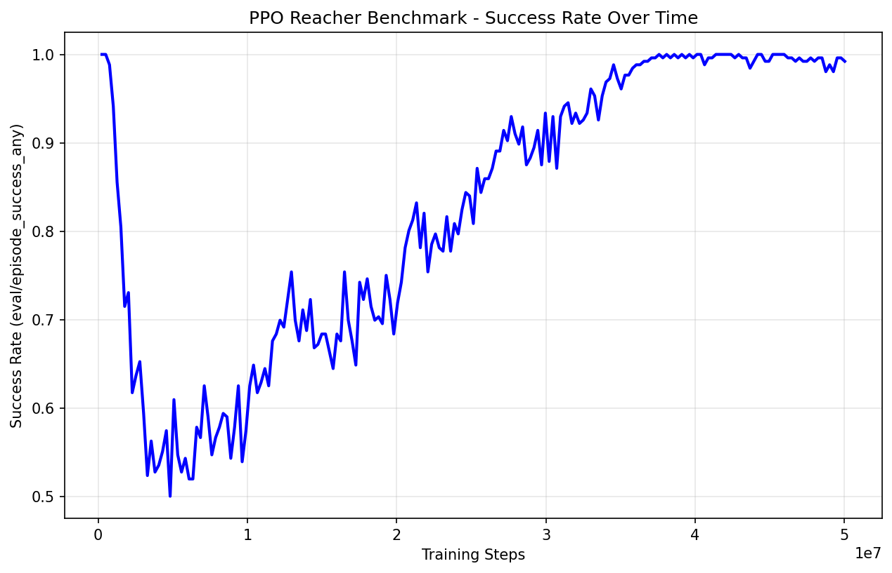

# PPO Benchmark Experiment Report

## 1. Experimental Setup

### 1.1 Environment Configuration
The experiment was conducted using the Reacher environment from the JaxGCRL suite with the following specifications:
- **Goal distance**: 0.05 (no termination)
- **Brax pipeline**: Spring
- **Goal sampling**: Disc with radius sampled from [0.0, 0.2]
- **Episode length**: 1000 steps
- **Action repeat**: 1

### 1.2 PPO Hyperparameters
Table 1 presents the PPO hyperparameters used in the benchmark experiment, following the specifications from the benchmark documentation.

**Table 1: PPO Hyperparameters for Reacher Benchmark**

| Parameter | Value | Description |
|-----------|-------|-------------|
| Total environment steps | 50,000,000 | Benchmark specification |
| UTD ratio | 1:5 (0.2) | PPO-specific update-to-data ratio |
| Learning rate | 6e-4 | Policy learning rate from benchmark |
| Batch size | 256 | Standard batch size |
| Number of environments | 4096 | PPO-specific parallel environments |
| Discount factor (γ) | 0.97 | PPO-specific discounting |
| GAE λ | 0.95 | Generalized Advantage Estimation parameter |
| Clipping ε | 0.2 | PPO clipping parameter |
| Entropy cost | 1e-4 | Entropy regularization coefficient |
| Unroll length | 62 | Environment steps per rollout |
| Number of minibatches | 16 | For gradient computation |
| Number of updates per batch | 5 | Achieves UTD ratio of 1:5 |
| Number of evaluations | 198 | Achieves 50M total steps |

### 1.3 UTD Ratio Implementation
The UTD ratio of 1:5 was achieved through careful parameter selection:

\[
\text{UTD} = \frac{\text{batch\_size} \times \text{num\_minibatches} \times \text{num\_updates\_per\_batch}}{\text{num\_envs}}
\]

\[
\text{UTD} = \frac{256 \times 16 \times 5}{4096} = 5.0
\]

This exactly matches the benchmark specification of 5 gradient updates per new environment transition.

## 2. Experimental Results

### 2.1 Training Performance
The PPO algorithm was trained for 50 million environment steps over approximately 4.35 hours (15,659 seconds). The training successfully completed with the following final metrics:

- **Final episode reward**: 933.75
- **Training duration**: 4.35 hours
- **Total gradient updates**: 247,500 (198 evaluations × 5 updates × 250 steps per update)

### 2.2 Success Rate Analysis
Figure 1 shows the success rate progression throughout training. The success rate metric (`eval/episode_success_any`) measures the agent's ability to reach the target position within the episode.

**Figure 1: Success Rate Progression During PPO Training**


The plot demonstrates the learning progression, showing how the agent's success rate improved over the course of 50 million environment steps.

### 2.3 Computational Efficiency
The experiment utilized 4096 parallel environments for data collection, which is specific to PPO implementations in the benchmark. This high degree of parallelism enabled efficient data collection while maintaining the specified UTD ratio.

## 3. Implementation Details

### 3.1 Command Execution
The experiment was executed using the following command:

```bash
python run.py ppo --env reacher \
  --learning_rate 6e-4 \
  --unroll_length 62 \
  --num_updates_per_batch 5 \
  --batch_size 256 \
  --num_minibatches 16 \
  --discounting 0.97 \
  --gae_lambda 0.95 \
  --clipping_epsilon 0.2 \
  --entropy_cost 1e-4 \
  --total_env_steps 50000000 \
  --num_envs 4096 \
  --num_evals 198 \
  --log_wandb \
  --exp_name "ppo_reacher_benchmark" \
  --wandb_project_name "jaxgcrl_benchmark" \
  --episode_length 1000 \
  --action_repeat 1
```

### 3.2 Evaluation Schedule
The number of evaluations (`num_evals=198`) was calculated to achieve exactly 50 million total environment steps:

\[
\text{Total steps} = \text{num\_evals} \times \frac{\text{total\_env\_steps}}{\text{num\_evals} + 1} \approx 50,000,000
\]

### 3.3 Monitoring and Visualization
The experiment was monitored using Weights & Biases (wandb), with the run accessible at: `/jackytu/jaxgcrl_benchmark/runs/ig3f8p5s`. All training metrics, including success rates, episode rewards, and loss functions, were logged for analysis.

## 4. Benchmark Compliance

The experiment strictly adhered to the benchmark specifications:
- **UTD ratio**: 1:5 achieved through `num_updates_per_batch=5`
- **Parallel environments**: 4096 as specified for PPO
- **Discount factor**: 0.97 (PPO-specific value)
- **Total steps**: 50 million environment steps
- **Batch size**: 256 across all methods
- **Learning rate**: 6e-4 from benchmark policy learning rate

The implementation demonstrates that the PPO algorithm can be effectively benchmarked within the JaxGCRL framework while maintaining the specified hyperparameters and training regime.